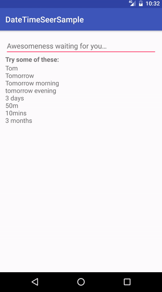

# DateTimeSeer
### A painless way to pick future time

DateTimeSeer is an android seer who gets visions of the date and time you are thinking. 

It tells you what you might be thinking and helps in what modern people call as autocompletion. Unfortunately, he currently knows only english.



**Gradle**

Add the seer to `build.gradle` and you are good to go,

```groovy
dependencies {
    compile 'com.pv:datetimeseer:1.0.0'
}
```

The library exposes `SeerFilter` which extends android's `Filter` class and so can be hooked to anything which implements `Filterable`. 

Use the `ConfigBuilder` to provide Date/Time formats.

The sample app here demonstrate the usage of the `Filter` with the `AutoCompleteTextView`. 


### Contributing

For other languages support, 

- Checkout the `dev` branch 
- Implement the changes for the language in [this package](https://github.com/p-v/DateTimeSeer/tree/dev/library/src/main/java/com/pv/datetimeseer/parser/handler). Check the [english language implementation](https://github.com/p-v/DateTimeSeer/tree/dev/library/src/main/java/com/pv/datetimeseer/parser/handler/english) for reference.  
- Add the `strings.xml`  file for the language
- Add the language to `Config.java`
- Update `getLocaleFromLanguage` in `DateTimeUtils.java`
- Initialize the handlers created in `SeerParserInitializer.java` for the language

Feel free to create an issue in case of any implementation issues. Or email me at the address present on my profile. 

### TODOS

- Add more documentation
- Some dirty code clean up


